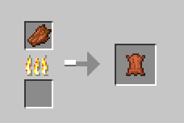

# rotten flesh 2 leather

This is a Minecraft rotten flesh smelting into leather the datapack

## Usage

Can be used **furnace**, **blast furnace** or **campfire** smelting

  

## Download

To download, go to the GitHub [Releases page](https://github.com/Lete114/minecraft_datapack_rotten_flesh2leather/releases)